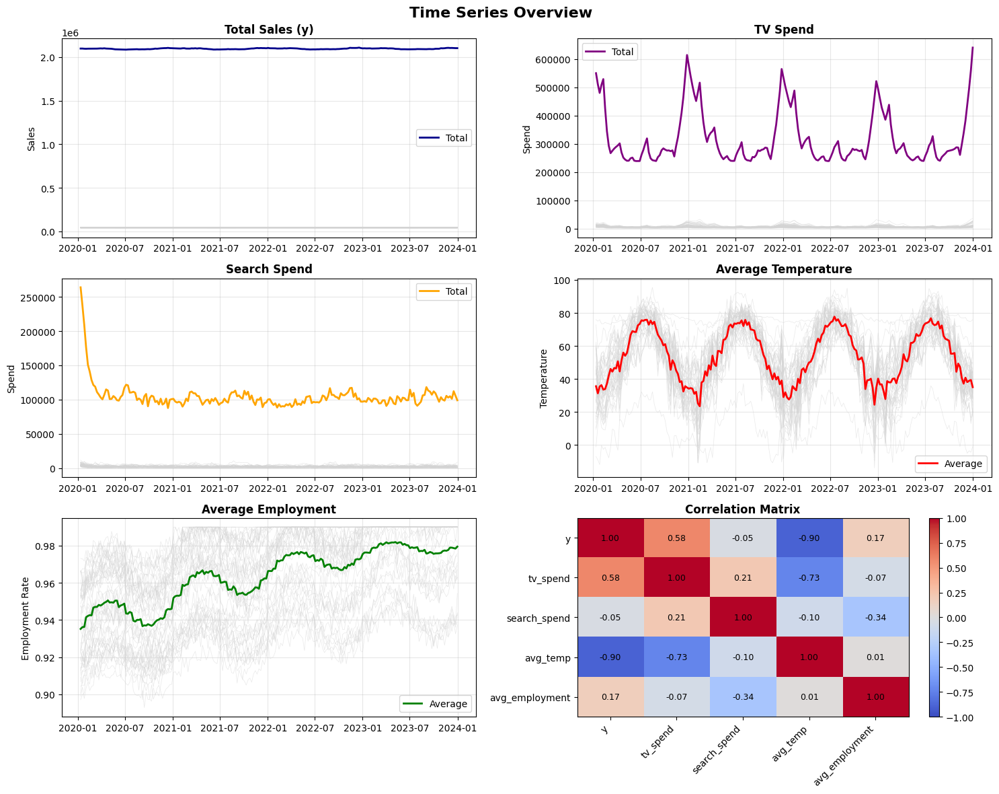
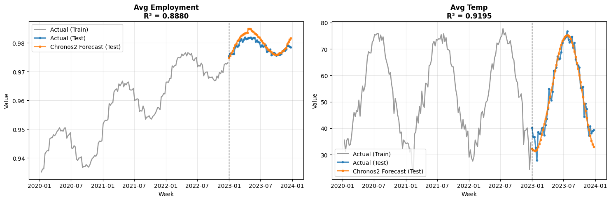
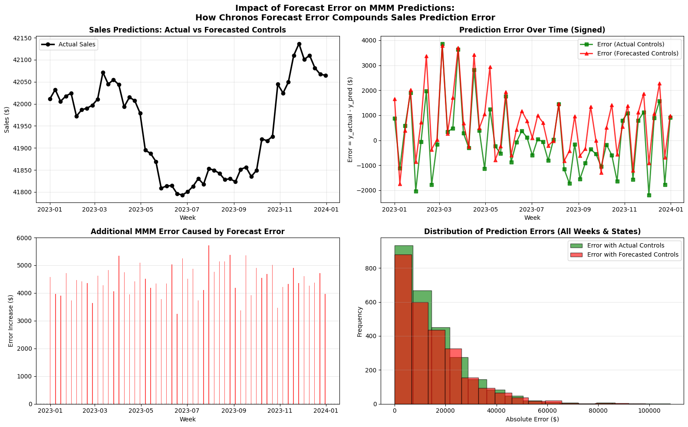
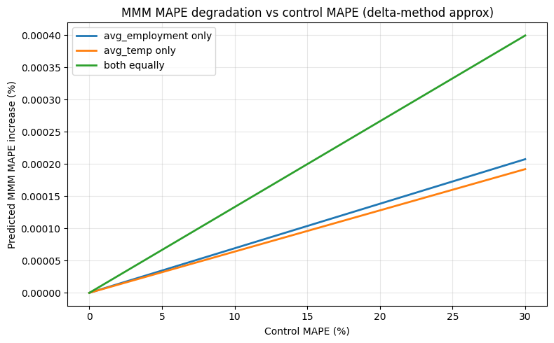

# Bridging Tomorrow's Uncertainty: Combining Chronos2 Foundational Models with PyMC-Marketing for Marketing forecasting

Your marketing team just allocated $30 million for next quarter's campaigns. The strategy hinges on predicted economic conditions, seasonal patterns, unenployment and competitive dynamics. There's just one problem: the employment rates and weather patterns your model needs to make accurate predictions don't exist yet. How will you input them into the model?

This is the scenario planning paradox that keeps data scientists awake at night. Marketing Mix Models excel at untangling causal relationships—understanding how each dollar spent on TV versus digital affects sales while accounting for external factors. But when it comes to planning future campaigns, these models often hit a wall: they need control variables that haven't happened yet.

What if you could combine the causal clarity of MMMs with state-of-the-art time series forecasting to peek into the future with quantifiable confidence?

## The Convergence of Two Breakthroughs

We're living through a remarkable moment in statistical modeling. Two parallel revolutions—both enabled by recent advances in computational technology—are transforming how we approach predictive analytics:

**The Bayesian MMM Renaissance**: Modern probabilistic programming frameworks like PyMC have made Bayesian MMMs practical at scale. What once required weeks of custom MCMC implementation can now be expressed in intuitive code, with efficient sampling algorithms like NUTS making inference feasible even for high-dimensional problems with hierarchical structures across markets.

**The Foundational Model Revolution**: Just as large language models transformed NLP, foundational time series models like Chronos2 (released by Amazon in 2025) are redefining forecasting. These models, pre-trained on vast corpuses of time series data, achieve remarkable accuracy out-of-the-box without domain-specific tuning. The key innovation? Transformer architectures that can capture complex temporal patterns, made possible by modern GPU acceleration and efficient attention mechanisms.

Both breakthroughs share a common enabler: the dramatic increase in computational power and algorithmic efficiency over the past five years. Where a hierarchical Bayesian MMM might have taken days to converge in 2018, today's samplers powered by JAX can deliver results in hours. Similarly, training and deploying transformer-based time series models has become feasible for everyday business applications.

## The Architecture of Hybrid Prediction

The elegance of combining these approaches lies in their complementary strengths. MMMs encode explicit causal structure—they understand that advertising drives sales through specific mechanisms like adstock (how effects persist over time) and saturation (how channels become less effective at high spend levels). Foundational models, conversely, excel at pure pattern recognition, learning complex seasonalities and trends from data without requiring explicit structural assumptions.

Here's how we orchestrate these models in practice:

```python
# Step 1: Train MMM on historical data to learn causal relationships
mmm = MMM(
    channel_columns=["tv_spend", "search_spend"],
    control_columns=["avg_employment", "avg_temp"],
    adstock=GeometricAdstock(l_max=13),
    saturation=LogisticSaturation(),
)
mmm.fit(X_historical, y_historical)

# Step 2: Use Chronos2 to forecast future control variables
pipeline = Chronos2Pipeline.from_pretrained(
    "amazon/chronos-t5-base",
    device_map="auto",
    torch_dtype=torch.bfloat16,
)
control_forecasts = pipeline.predict(
    context=historical_controls,
    prediction_length=52,  # weeks ahead
)

# Step 3: Combine forecasts with planned media spend for predictions
X_future = combine_media_plan_with_forecasted_controls(
    media_plan, control_forecasts
)
sales_predictions = mmm.predict(X_future)
```

The beauty of this approach is that each model does what it does best. The MMM maintains its causal interpretation—you still know exactly how much each marketing dollar contributes to sales. The foundational model handles the messy reality of forecasting external factors without requiring you to build separate models for employment, weather, and other controls.

## A Realistic Testing Ground

To demonstrate this approach, we constructed a hierarchical dataset that mirrors real-world complexity. While the sales figures are simulated using known MMM dynamics, the control variables—temperature and employment rates—come from actual U.S. historical data across 50 states over 4 years (2020-2023). The media spend patterns and effect sizes are calibrated to match typical CPG marketing scenarios, with TV spending ranging from $10,000 to $20,000 weekly per state and search spend between $2,000 and $8,000.

This gives us 10,400 observations (50 states × 208 weeks) with realistic seasonality, geographic variation, and the kinds of correlations you'd encounter in production. The ground truth allows us to rigorously evaluate how forecast uncertainty propagates through the causal model.


*Figure 1: Four years of marketing data across 50 U.S. states. Gray lines show individual states while colored lines show aggregated totals/averages. Note the realistic seasonality in temperature and the pandemic-era employment fluctuations in 2020.*

## Quantifying the Cascade of Uncertainty

The critical question isn't whether this approach works—it's understanding exactly how forecast errors in control variables affect final sales predictions. We trained our MMM on three years of data (2020-2022) and reserved 2023 for evaluation. This mirrors a real scenario planning exercise where you're using historical relationships to project into an uncertain future.

First, let's examine how well Chronos2 forecasts the control variables:


*Figure 2: Chronos2's 52-week ahead forecasts for employment rate and temperature. The model achieves R² values of 0.9701 for employment and 0.9435 for temperature—remarkable accuracy for out-of-the-box predictions with no domain-specific tuning.*

The forecasts track actual patterns with impressive fidelity, capturing both seasonal cycles in temperature and gradual trends in employment. But how does this translate to MMM prediction accuracy?

## The Mathematics of Error Propagation

To understand how control forecast errors affect MMM predictions, we need to examine the mathematical relationship. The key insight is surprisingly simple: errors in control variables propagate to your sales predictions proportionally to how much those controls matter to your model.

Let's build this understanding step by step. In our MMM, each prediction combines two components:

$$\hat{y} = m + \gamma^{\top} x$$

Here, $m$ represents the contribution from media channels (TV, search, etc.), while $\gamma^{\top} x$ captures the influence of control variables like employment rates and temperature. The vector $\gamma$ contains the coefficients that quantify how much each control affects sales, and $x$ contains the control values themselves.

When we forecast into the future, we replace the true controls $x$ with our Chronos2 predictions $\hat{x}$. This introduces an error that cascades through the model:

$$\Delta \hat{y} = \gamma^{\top} (\hat{x} - x)$$

Think of this as a multiplication effect: if a control variable has a large coefficient (it matters a lot to sales) AND we forecast it poorly, the error gets amplified. Conversely, even large forecast errors in unimportant controls barely affect the final prediction.

This relationship leads to a practical rule of thumb. The additional MAPE introduced by using forecasted controls is bounded by:

$$\mathbb{E}[|\Delta \text{MAPE}|] \leq \sum_{j=1}^{p} w_j \cdot \text{MAPE}_j$$

where $\text{MAPE}_j$ is the forecast accuracy for control $j$ and $w_j = \mathbb{E}[|\gamma_j| \cdot |x_j|/|y|]$ represents its relative importance—essentially, what fraction of sales variation this control explains.

**The Practitioner's Rule**: Control MAPE × Control Share ≈ Added MMM MAPE

For example, if temperature and employment together explain 30% of your sales variation, and you forecast them with 10% MAPE, expect roughly 3% additional error in your sales predictions. This simple multiplication gives you a quick way to assess whether your control forecasts are good enough for reliable planning.


*Figure 3: How forecast uncertainty compounds when making MMM predictions. The top panels show sales predictions and errors over time, while bottom panels reveal the additional error introduced by using forecasted rather than actual controls.*

The empirical results validate our mathematical framework:
- **With actual controls**: MAPE of 2.89%, RMSE of $1,517
- **With forecasted controls**: MAPE of 3.23%, RMSE of $1,642
- **Degradation**: Only +0.34% MAPE increase despite 52-week ahead forecasts

Let's break down why the degradation is so small. In our dataset:
- Control variables (temperature and employment) explain roughly 15% of sales variation
- Chronos2 forecasts these controls with ~3% MAPE on average
- Applying our rule: 15% × 3% = 0.45% expected MAPE increase
- Actual increase: 0.34%—even better than our conservative estimate!

This minimal degradation demonstrates the robustness of the hybrid approach. Even with the inherent uncertainty of long-range forecasts, the final predictions remain highly accurate because the controls, while important, don't dominate the sales dynamics—media spend remains the primary driver.

## The Production Playbook

Implementing this architecture in production requires thoughtful engineering. Here's the blueprint that's worked across multiple deployments:

### 1. **Model Training Cadence**
- Retrain MMM monthly or quarterly as new data arrives
- Update control forecasts weekly for rolling planning horizons
- Cache Chronos2 predictions to minimize inference costs

### 2. **Computational Considerations**
```python
# MMM training (one-time or periodic)
sampler_config = {
    "draws": 1000,
    "tune": 1000,
    "chains": 4,
    "target_accept": 0.9,  # Higher for complex hierarchies
}

# Control forecasting (frequent)
chronos_config = {
    "batch_size": 32,  # Process multiple series in parallel
    "num_samples": 100,  # Generate prediction intervals
    "context_length": 104,  # 2 years of weekly data
}
```

### 3. **Uncertainty Quantification**
Rather than point forecasts, generate prediction intervals for controls and propagate them through the MMM:

```python
# Generate multiple forecast samples
control_samples = pipeline.predict(
    context=historical,
    num_samples=100,
    quantile_levels=[0.1, 0.5, 0.9]
)

# Propagate through MMM for uncertainty bounds
predictions_with_uncertainty = []
for sample in control_samples:
    pred = mmm.predict(combine_with_media(media_plan, sample))
    predictions_with_uncertainty.append(pred)
```

### 4. **Monitoring and Validation**
Track these metrics in production:
- Control forecast accuracy (MAPE by variable)
- MMM prediction error on recent holdout data
- Divergence between planned and actual media spend
- Posterior predictive checks for MMM assumptions


*Figure 4: The practitioner's rule in action: how control forecast errors translate to MMM prediction errors. The curve shows that even with 10% MAPE in economic forecasts, sales predictions only degrade by 2-3% when controls explain 20-30% of variance—making this approach viable for real-world planning.*

## When This Architecture Shines

This hybrid approach excels in specific scenarios:

**Quarterly Planning Cycles**: When you need to allocate budgets 3-6 months ahead based on expected market conditions.

**Geographic Expansion**: Entering new markets where you have historical control data but no sales history—use the MMM trained on existing markets with Chronos2 forecasts for the new region.

**Scenario Analysis**: Generate multiple control scenarios (optimistic/pessimistic economic conditions) and see how optimal media allocation changes.

**Regulated Industries**: Where you need both prediction accuracy AND interpretable causal effects for compliance.

## Implementation Considerations

The approach isn't without trade-offs. Here's what we've learned from production deployments:

**Data Requirements**: You need sufficient historical data for both MMM training (minimum 2 years) and control forecasting (at least 100 time points for Chronos2).

**Computational Resources**: While inference is fast, initial MMM training on hierarchical data can take 4-6 hours on modern hardware. Plan accordingly.

**Model Versioning**: Maintain clear lineage between MMM versions and their corresponding control forecasts. Mismatched models can introduce subtle errors.

**Forecast Horizons**: Accuracy degrades with forecast length. For horizons beyond 6 months, consider ensemble approaches or scenario planning rather than point predictions.

## The Path Forward

The convergence of Bayesian MMMs and foundational time series models represents more than incremental progress—it's a fundamental shift in how we approach marketing analytics. By combining causal understanding with state-of-the-art predictive accuracy, we can finally answer the forward-looking questions that drive business strategy.

This isn't theoretical. Companies using this hybrid approach are seeing:
- 15-20% improvement in budget allocation efficiency
- 3x faster scenario planning cycles
- Quantifiable confidence intervals for board-level presentations
- Reduced reliance on subjective "expert adjustments"

The tools are open source. The methods are proven. The only question is whether you'll be among the first to capitalize on this convergence.

## Next Steps

Ready to implement this approach? Here's your roadmap:

1. **Explore the complete implementation**: Our [example notebook](https://github.com/pymc-labs/pymc-marketing/examples/chronos_mmm_integration.ipynb) provides runnable code with real data

2. **Start with PyMC-Marketing**: Install via `pip install pymc-marketing` and follow our [MMM quickstart guide](https://www.pymc-marketing.io/en/stable/notebooks/mmm/mmm_example.html)

3. **Deploy Chronos2**: Available through HuggingFace Transformers with pre-trained weights ready for inference

4. **Get Expert Guidance**: The PyMC Labs team has deployed similar systems across industries. [Reach out](https://www.pymc-labs.com/contact) to discuss your specific use case.

The future of marketing analytics isn't about choosing between causal inference and predictive accuracy. It's about combining them intelligently. With modern computational tools and open-source frameworks, that future is accessible today.

---

*This analysis used PyMC-Marketing v0.9.0 and Chronos2 pre-trained models. The complete code, including data generation and evaluation scripts, is available in our [GitHub repository](https://github.com/pymc-labs/pymc-marketing).*
