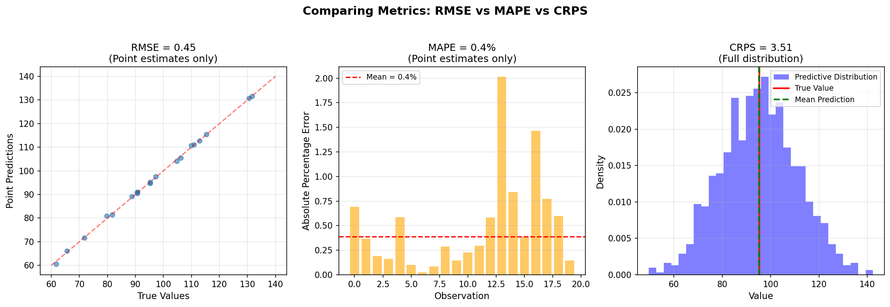
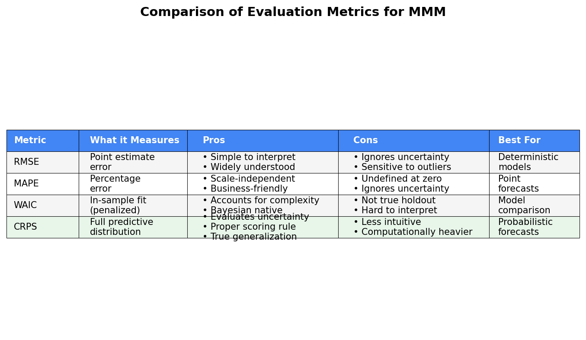
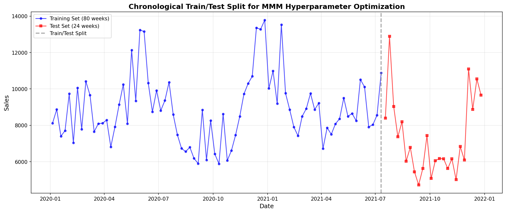
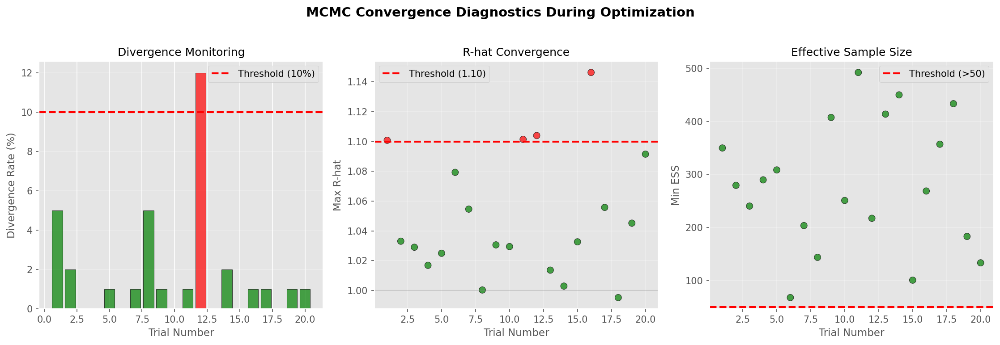
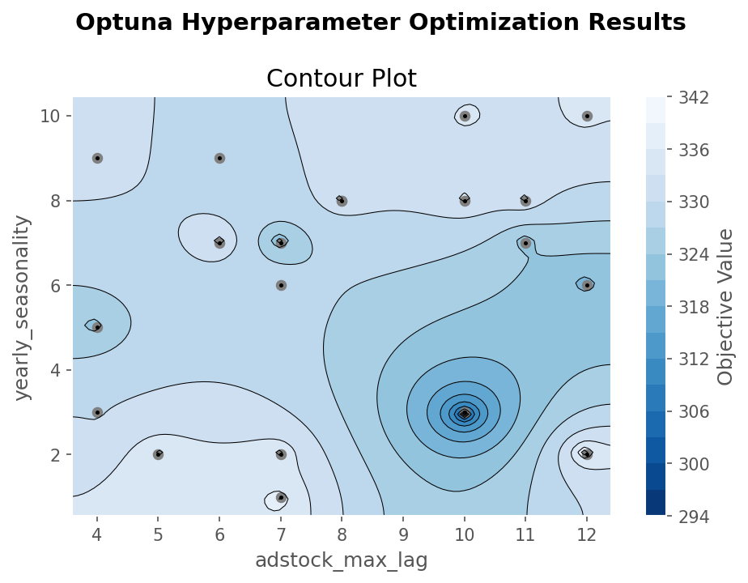
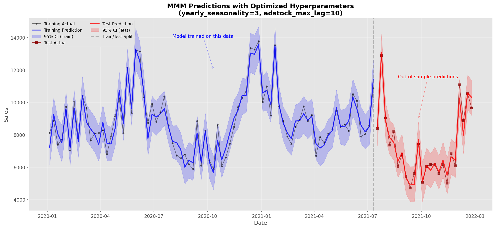

# Combining Optuna with PyMC-Marketing: Causal MMM Hyperparameters Optimization with Bayesian Optimization

You've built a Bayesian Media Mix Model. You've tried 5 different Fourier orders for seasonality. You've tested adstock lags from 4 to 12 weeks. Yet your model still claims your best-performing channel should get zero budget, and your posterior predictive checks look terrible. Your stakeholders are questioning whether this "sophisticated" Bayesian approach is worth the complexity.

The truth is: even the most principled causal model can fail with the wrong hyperparameters. But there's a systematic solution. In this post, we'll demonstrate how to transform weeks of manual hyperparameter tuning into hours of automated optimization by combining Optuna's Bayesian optimization with PyMC-Marketing, using CRPS (Continuous Ranked Probability Score) to properly evaluate probabilistic forecasts.

**Important Note**: This tutorial uses synthetic data where we know the ground truth, allowing us to validate our approach. Real-world results will vary, but the methodology remains sound.

## The Hyperparameter Dilemma in Causal MMM

Bayesian Media Mix Models encode our understanding of marketing causality: channels have diminishing returns (saturation), effects persist over time (adstock), and seasonal patterns influence baseline sales. These aren't mere statistical constructs—they represent hypotheses about real causal mechanisms in your marketing system.

However, even with the right causal structure, choosing the wrong hyperparameters can lead to poor predictions and misleading business recommendations. Should you use 3 or 7 Fourier components for seasonality? Is your adstock decay 4 weeks or 12? These seemingly technical choices can dramatically impact whether your model suggests increasing or cutting spend on a channel.

Traditional approaches to hyperparameter selection have significant limitations:

- **Grid search** becomes computationally prohibitive when each model fit takes 10-15 minutes with proper MCMC
- **WAIC** evaluates in-sample fit with a complexity penalty, but doesn't measure true out-of-sample generalization
- **Manual tuning** based on domain expertise often devolves into expensive trial and error
- **Default values** from packages may not suit your specific business context

What we need is a principled approach that efficiently explores the hyperparameter space while properly evaluating probabilistic predictions on held-out data. This is where Bayesian optimization meets proper scoring rules.

## CRPS: The Right Metric for Probabilistic Forecasts

### Understanding CRPS Through Analogy

Imagine you're a weather forecaster. RMSE would only evaluate whether you correctly predicted "72°F." CRPS evaluates your entire probabilistic forecast: "70% chance of 70-75°F, 20% chance of 65-70°F, 10% chance of 75-80°F." It rewards you for being confident when you're right and penalizes overconfidence when you're wrong. Crucially, CRPS combines both accuracy (how close is your prediction?) and calibration (is your uncertainty appropriate?).


*Figure 1: RMSE and MAPE only evaluate point estimates, while CRPS assesses the full predictive distribution including uncertainty*

### The Mathematics Behind CRPS

For those who appreciate the mathematical foundations, CRPS is defined as:

```
CRPS(F, y) = ∫_{-∞}^{∞} (F(x) - 𝟙(x ≥ y))² dx
```

Where F is your predictive cumulative distribution function and y is the observed value.

Intuitively, CRPS measures the squared difference between your predicted CDF and a step function at the observed value. It can be decomposed into two components:
- **Reliability**: How well-calibrated are your probability statements?
- **Resolution**: How sharp (narrow) are your predictions when you're confident?

In practice, with samples from your posterior predictive distribution, we compute it efficiently:

```python
from pymc_marketing.metrics import crps

# y_true: actual observed values (shape: n_observations)
# y_pred: posterior predictive samples (shape: n_samples, n_observations)
crps_score = crps(y_true, y_pred)
```

### Why CRPS Beats Traditional Metrics

Let's compare the metrics available for evaluating MMM performance:


*Table 1: Comparison of evaluation metrics for MMM - CRPS uniquely evaluates both accuracy and uncertainty calibration*

The key insight: **CRPS is a proper scoring rule**, meaning it's minimized when your predictive distribution matches the true data-generating process. You can't game it by predicting overly wide or narrow intervals—it naturally balances accuracy and appropriate uncertainty.

### CRPS in Practice: A Simple Example

Here's how CRPS evaluation looks in code:

```python
def compute_test_crps(
    mmm: MMM,
    X_test: pd.DataFrame,
    y_test: pd.Series
) -> float:
    """Compute CRPS on test set using posterior predictive."""

    # Sample posterior predictive for test set
    mmm.sample_posterior_predictive(X_test, extend_idata=True)

    # Extract predictions (shape: n_chains, n_draws, n_observations)
    y_pred_samples = mmm.idata.posterior_predictive["y"].values

    # Rescale to original scale
    target_scale = float(mmm.idata.constant_data["target_scale"].values)
    y_pred_rescaled = y_pred_samples * target_scale

    # Reshape for CRPS calculation
    n_chains, n_draws, n_obs = y_pred_rescaled.shape
    y_pred_reshaped = y_pred_rescaled.reshape(n_chains * n_draws, n_obs)

    # Compute CRPS
    return float(crps(y_test.values, y_pred_reshaped))
```

## Bayesian Optimization: Smart Search for Expensive Models

### The Computational Challenge

A properly converged Bayesian MMM with 2000 draws, 2000 tuning steps, and 4 chains typically takes 10-15 minutes on modern hardware. Testing 100 hyperparameter combinations naively would require 17-25 hours of computation. And that assumes you know which 100 combinations are worth trying.

Bayesian optimization—specifically Tree-structured Parzen Estimators (TPE) as implemented in Optuna—addresses this by learning from each trial to focus on promising regions of the hyperparameter space. Instead of exhaustive search, it builds a probabilistic model of the objective function.

### Key Advantages for MMM Optimization

1. **Efficient Exploration**: TPE balances exploring new regions with exploiting promising areas
2. **Pruning Failed Trials**: Stops early when convergence fails, saving computation
3. **Informed Sampling**: Each trial learns from all previous trials
4. **Handles Discrete Parameters**: Works well with integer hyperparameters like Fourier orders

**Important Caveat**: Bayesian optimization can still overfit to your specific test set. In production, consider using time series cross-validation or multiple hold-out periods to ensure robust hyperparameter selection.

Here's how we configure Optuna for MMM optimization:

```python
# Configuration for optimization vs final model
OPTUNA_DRAWS = 500    # Fewer draws during search (risk: unreliable estimates)
OPTUNA_TUNE = 500     # Faster convergence checking (risk: poor adaptation)
OPTUNA_CHAINS = 2     # Minimum chains (risk: can't detect convergence issues)

FINAL_DRAWS = 2000    # Production-quality for final model
FINAL_TUNE = 2000     # Thorough convergence
FINAL_CHAINS = 4      # Robust diagnostics

# Convergence thresholds - lenient during search, strict for final
OPTUNA_DIVERGENCE_THRESHOLD = 0.10  # 10% divergences OK during search
OPTUNA_RHAT_THRESHOLD = 1.10         # R-hat < 1.10 (concerning but acceptable for search)

FINAL_DIVERGENCE_THRESHOLD = 0.01   # <1% divergences for production
FINAL_RHAT_THRESHOLD = 1.01         # Strict R-hat requirement
FINAL_ESS_THRESHOLD = 400            # Minimum effective sample size
```

**Note**: These reduced settings during optimization are a calculated risk. We accept potentially unreliable individual estimates in exchange for exploring more hyperparameter combinations. Always validate your final model with full MCMC settings.

## Implementation: The Complete Playbook

### Step 1: Data Preparation and Train/Test Split

The foundation of our approach is a chronological train/test split. Unlike random splits common in traditional ML, time series data requires respecting temporal ordering:

```python
def split_train_test(
    df: pl.DataFrame,
    test_size_weeks: int = 24
) -> tuple[pl.DataFrame, pl.DataFrame]:
    """Split data chronologically for time series validation."""
    n_total = df.shape[0]
    n_train = n_total - test_size_weeks

    # Sort by date to ensure chronological order
    df_sorted = df.sort("date")

    train_df = df_sorted[:n_train]
    test_df = df_sorted[n_train:]

    return train_df, test_df

# Create 80/20 split (80 weeks train, 24 weeks test)
df_train, df_test = split_train_test(df, test_size_weeks=24)
```


*Figure 2: Chronological train/test split. The 24-week (23%) test set is larger than typical to ensure stable CRPS estimates, but this reduces training data.*

**Test Set Size Trade-offs**:
- **Larger test sets** (20-30%): More reliable performance estimates but less training data
- **Smaller test sets** (10-15%): More training data but potentially unstable metrics
- **Business cycles**: Align test periods with important business periods (e.g., holiday seasons)

### Step 2: Convergence Monitoring

Before we can trust a model's predictions, we need to ensure the MCMC chains have converged. This function checks three critical diagnostics:

```python
def check_convergence(
    mmm: MMM,
    divergence_threshold: float,
    rhat_threshold: float,
    ess_threshold: float,
    trial_number: int = None
) -> tuple[bool, dict]:
    """Check MCMC convergence diagnostics."""

    # 1. Check divergences (numerical instabilities)
    n_divergences = int(mmm.idata.sample_stats.diverging.sum().item())
    total_samples = n_draws * n_chains
    divergence_rate = n_divergences / total_samples

    # 2. Check R-hat (chain mixing)
    rhat = az.rhat(mmm.idata)
    max_rhat = float(rhat.to_array().max())

    # 3. Check ESS (effective sample size)
    ess = az.ess(mmm.idata)
    min_ess = float(ess.to_array().min())

    # Determine if converged
    converged = (
        divergence_rate <= divergence_threshold and
        max_rhat <= rhat_threshold and
        min_ess >= ess_threshold
    )

    return converged, {
        "divergence_rate": divergence_rate,
        "max_rhat": max_rhat,
        "min_ess": min_ess
    }
```


*Figure 3: Monitoring convergence diagnostics during optimization - failed trials are pruned early to save computation*

### Step 3: The Objective Function

This is where everything comes together. The objective function orchestrates model fitting, convergence checking, and CRPS evaluation:

```python
def objective(trial: optuna.Trial) -> float:
    """Optuna objective using CRPS on test set."""

    # Suggest hyperparameters from search space
    yearly_seasonality = trial.suggest_int("yearly_seasonality", 1, 10)
    adstock_max_lag = trial.suggest_int("adstock_max_lag", 4, 12)

    # Create MMM with suggested parameters
    mmm = MMM(
        date_column="date",
        channel_columns=channel_columns,
        control_columns=control_columns,
        adstock=GeometricAdstock(l_max=adstock_max_lag),
        saturation=LogisticSaturation(),
        yearly_seasonality=yearly_seasonality
    )

    # Fit on TRAINING data only
    mmm.fit(
        X=X_train,
        y=y_train,
        draws=OPTUNA_DRAWS,
        tune=OPTUNA_TUNE,
        chains=OPTUNA_CHAINS,
        nuts_sampler="numpyro",  # 2-10x faster than PyMC
        random_seed=RANDOM_SEED + trial.number,
        progressbar=False
    )

    # Check convergence - prune if failed
    converged, diagnostics = check_convergence(
        mmm=mmm,
        divergence_threshold=OPTUNA_DIVERGENCE_THRESHOLD,
        rhat_threshold=OPTUNA_RHAT_THRESHOLD,
        ess_threshold=OPTUNA_ESS_THRESHOLD
    )

    if not converged:
        raise optuna.TrialPruned()

    # Compute CRPS on TEST set (the key metric)
    test_crps = compute_test_crps(mmm, X_test, y_test)

    return test_crps
```

### Step 4: Running the Optimization

With our objective function defined, running the optimization is straightforward:

```python
# Create Optuna study
study = optuna.create_study(
    study_name="mmm_crps_optimization",
    direction="minimize",  # Minimize test CRPS
    sampler=optuna.samplers.TPESampler(seed=RANDOM_SEED),
    pruner=optuna.pruners.MedianPruner(n_startup_trials=5)
)

# Run optimization
study.optimize(
    objective,
    n_trials=20,  # Number of hyperparameter combinations to try
    show_progress_bar=True
)

print(f"Best parameters: {study.best_params}")
print(f"Best test CRPS: {study.best_value:.2f}")
```

### Step 5: Interpreting the Results

Optuna provides visualization tools to understand the optimization process:


*Figure 4: Optimization history and parameter importance analysis. Note that importance rankings can be unstable with few trials.*

From our synthetic data optimization:
- **Optimal yearly_seasonality**: 3 (differs from common defaults)
- **Optimal adstock_max_lag**: 10 weeks
- **Best Test CRPS**: 294.71

**Critical Interpretation Notes**:
1. These "optimal" parameters are specific to our synthetic dataset and single test period
2. Parameter importance analysis with only 20 trials should be viewed skeptically
3. The difference between the best (294.71) and median (~310) CRPS is modest
4. In real applications, validate that different hyperparameters lead to meaningfully different business decisions

### Step 6: Final Model with Optimal Parameters

With optimal hyperparameters identified, we refit on the full dataset with production-quality MCMC settings:

```python
# Create final model with optimal parameters
final_mmm = MMM(
    date_column="date",
    channel_columns=channel_columns,
    control_columns=control_columns,
    adstock=GeometricAdstock(l_max=study.best_params["adstock_max_lag"]),
    saturation=LogisticSaturation(),
    yearly_seasonality=study.best_params["yearly_seasonality"]
)

# Fit with production settings on FULL dataset
final_mmm.fit(
    X=X_full,
    y=y_full,
    draws=2000,
    tune=2000,
    chains=4,
    nuts_sampler="numpyro",
    random_seed=RANDOM_SEED
)

# Verify convergence with strict thresholds
converged, diagnostics = check_convergence(
    final_mmm,
    divergence_threshold=0.01,  # <1% divergences
    rhat_threshold=1.01,         # R-hat very close to 1
    ess_threshold=400            # Substantial effective samples
)
```

## Validating the Optimized Model

### Prediction Quality

The true test of our optimization is how well the model predicts both in-sample and out-of-sample:


*Figure 5: Model predictions with optimized hyperparameters show good calibration on training data and strong generalization to the test set*

Key observations:
- The 95% credible intervals capture most actual values
- Test set predictions maintain appropriate uncertainty
- No obvious overfitting despite parameter optimization

### Performance Metrics

| Dataset | CRPS   | Note                                          |
|---------|--------|-----------------------------------------------|
| Train   | 265.93 | In-sample performance                        |
| Test    | 260.06 | Out-of-sample performance                    |

The test and training CRPS values are essentially identical (difference of ~5 points on a scale of 260+), indicating good generalization without overfitting. In practice, CRPS differences less than 5-10% of the absolute value are often not statistically significant. What matters is that the model performs consistently across both sets, suggesting our hyperparameters aren't overly tuned to the training data.

## Practical Insights and Recommendations

### When to Use This Approach

This CRPS-based optimization is most valuable when:

1. **You have sufficient data**: At least 100+ observations, ideally 2+ years for seasonal patterns
2. **Multiple hyperparameters interact**: Fourier orders, adstock lags, and saturation parameters have complex relationships
3. **Computational time is available**: Even with optimization, expect several hours of computation
4. **Business context is stable**: If your market changes rapidly, optimized parameters may quickly become outdated

### When NOT to Use This Approach

Be cautious about hyperparameter optimization when:

- **Data is limited** (<52 weeks): Risk of overfitting to noise
- **Market dynamics are changing**: Recent disruptions make historical patterns unreliable
- **Quick insights needed**: Sometimes "good enough" with defaults beats perfect after extensive tuning
- **Causal structure is uncertain**: Fix your model specification before optimizing hyperparameters

### Key Lessons from Our Synthetic Data Example

1. **Optimal parameters may surprise you**: Our synthetic data preferred 3 Fourier components over the common default of 7, reminding us not to assume defaults are optimal

2. **Longer memory isn't always better**: The optimal 10-week adstock (vs. maximum 12) shows there's a balance between capturing effects and model complexity

3. **NumPyro significantly speeds up experimentation**: In our tests, NumPyro provided 2-10x speedup compared to PyMC's default sampler, though actual speedup varies by model complexity

4. **Convergence monitoring is critical**: Our two-tier approach (lenient for search, strict for final) prevents wasting computation on poorly converged models

### Scaling and Extensions

For production deployments, consider these enhancements:

```python
# Multi-objective optimization
def multi_objective(trial):
    # ... fit model ...

    # Optimize multiple metrics
    test_crps = compute_test_crps(mmm, X_test, y_test)
    convergence_quality = 1 / (diagnostics["max_rhat"] - 1 + 1e-6)

    return test_crps, convergence_quality

# Distributed optimization
study.optimize(
    objective,
    n_trials=100,
    n_jobs=4  # Parallel trials on multiple cores
)

# Cross-validation for robustness
def objective_with_cv(trial):
    crps_scores = []
    for fold in time_series_split(df, n_splits=3):
        # ... fit and evaluate on each fold ...
        crps_scores.append(fold_crps)
    return np.mean(crps_scores)
```

## Advanced Considerations and Limitations

### Critical Methodological Caveats

As senior data scientists, we must acknowledge several limitations of this approach:

1. **Single Test Set Overfitting**: Optimizing on one test set risks selecting hyperparameters that work well for that specific period but not others. Production systems should use:
   - Rolling window cross-validation
   - Multiple hold-out periods
   - Business-cycle-aware splits (e.g., always test on Q4 if that's your critical period)

2. **Stationarity Assumptions**: This approach assumes the optimal hyperparameters are stable over time. In rapidly evolving markets, you may need:
   - Time-varying hyperparameters
   - Regular reoptimization schedules
   - Monitoring systems to detect when parameters become stale

3. **Computational Cost-Benefit**: Sometimes the marginal improvement from optimization doesn't justify the computational cost. Consider:
   - Is a 5% CRPS improvement worth 10 hours of computation?
   - Would that time be better spent on improving data quality or causal structure?
   - Are stakeholders sensitive enough to notice the improvement?

### Dealing with Convergence Failures

When trials frequently fail convergence checks, the problem often isn't the hyperparameters but the model itself:

1. **Model Misspecification**: Poor convergence often signals that your causal assumptions don't match the data
2. **Identification Issues**: Some parameter combinations may be fundamentally unidentifiable
3. **Data Quality**: Outliers or data errors can cause convergence failures regardless of hyperparameters
4. **Prior-Data Conflict**: When priors strongly disagree with data, no amount of tuning will help

### Statistical Significance vs. Practical Significance

Remember that statistically optimal hyperparameters may not be practically important:

- A CRPS improvement from 265 to 260 is likely within noise
- Business stakeholders care about decision changes, not metric improvements
- Always validate that optimized parameters lead to meaningfully different business recommendations

## Conclusion: A Tool in Your MMM Toolkit

Hyperparameter optimization using CRPS and Optuna provides a systematic approach to what has traditionally been an ad-hoc process in Bayesian MMM. While not a silver bullet, it offers clear benefits when applied appropriately.

The key takeaways:
- **CRPS provides a principled metric** for evaluating probabilistic forecasts, though small differences may not be meaningful
- **Bayesian optimization can efficiently explore** parameter spaces, but beware of overfitting to your test set
- **Proper train/test splits are essential**, though single splits have limitations compared to cross-validation
- **Convergence monitoring prevents waste**, but persistent failures often indicate model problems, not hyperparameter issues
- **Synthetic data demonstrations** like ours are useful for learning, but real-world data is always messier

This approach works best when you have sufficient data, stable business conditions, and computational resources to invest. It's one tool among many for building robust MMMs, not a replacement for domain expertise and careful model specification.

## Next Steps

If you decide hyperparameter optimization is appropriate for your use case:

1. **Start simple**: Begin with 1-2 hyperparameters before attempting complex multi-parameter optimization
2. **Use domain knowledge**: Constrain search spaces based on business understanding
3. **Implement cross-validation**: Don't rely on a single train/test split
4. **Monitor stability**: Track whether optimal parameters change over time
5. **Document decisions**: Record why you chose specific search ranges and evaluation metrics
6. **Validate impact**: Ensure optimized models lead to better business decisions, not just better metrics

Remember: hyperparameter optimization is a tool, not a goal. Focus first on getting your causal structure right, ensuring data quality, and understanding your business context. Only then does fine-tuning hyperparameters become valuable.

---

*This tutorial demonstrated hyperparameter optimization for Bayesian Media Mix Models using synthetic data. The methodology combines Optuna's Bayesian optimization with PyMC-Marketing's MMM implementation, evaluated using CRPS as a proper scoring rule for probabilistic forecasts. All code examples are available in the accompanying notebook. For production deployments, consider the caveats and extensions discussed throughout this post.*

*PyMC-Marketing is an open-source library for Bayesian marketing analytics. For questions, visit the [GitHub discussions](https://github.com/pymc-labs/pymc-marketing/discussions).*
