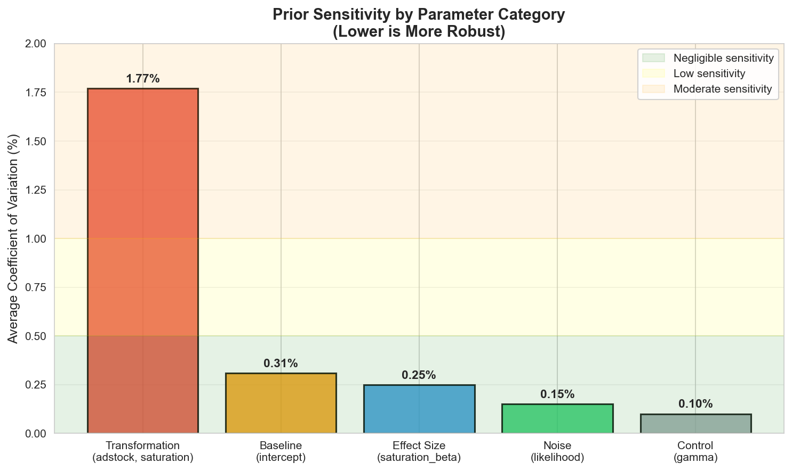
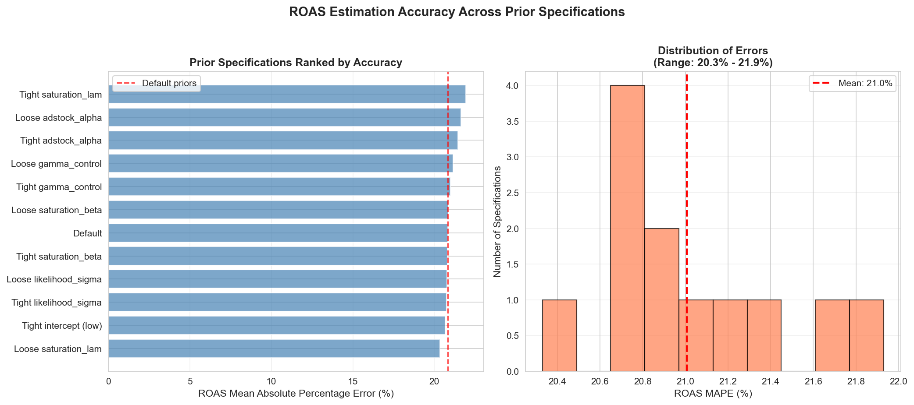
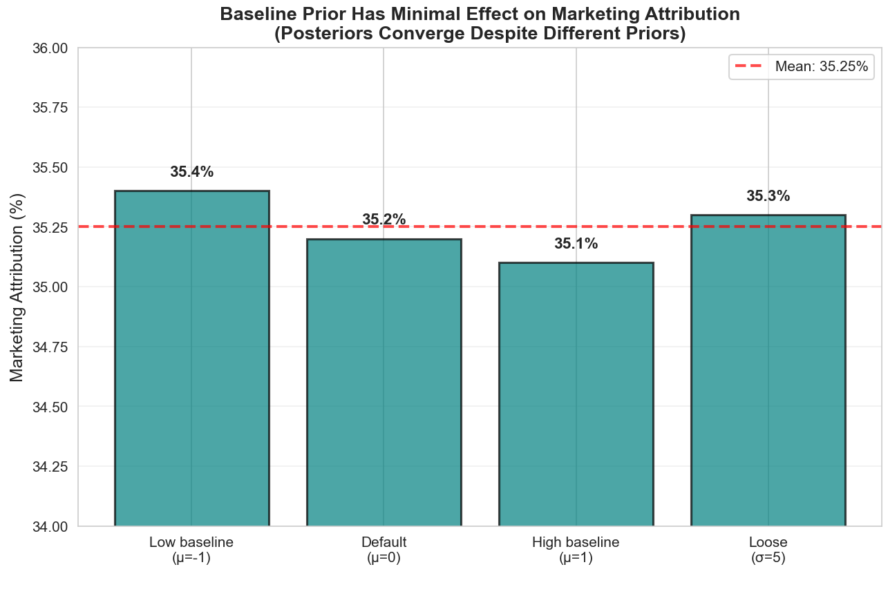
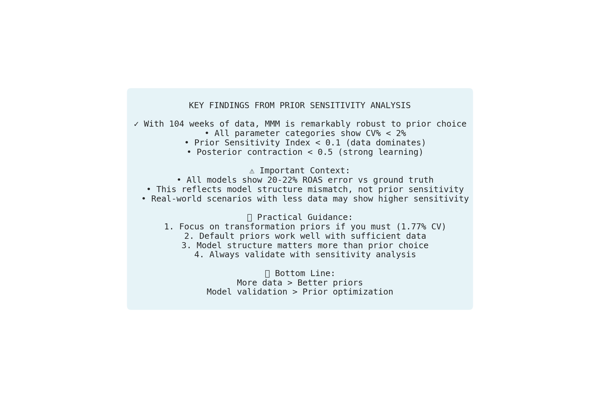

# Stop Agonizing Over MMM Priors: A Data-Driven Analysis and Playbook to Set Them

You've been there. Three hours into debugging why your Media Mix Model won't converge. Another hour tweaking prior distributions. Your stakeholders are asking why the model says to spend $0 on your best-performing channel. Meanwhile, your posterior distributions look like abstract art rather than statistical inference.

Here's the uncomfortable truth: priors in MMM aren't just mathematical niceties—they're make-or-break decisions that affect everything from computational efficiency to business strategy. But which priors actually matter? Where should you invest your limited time? And how can you systematically validate your choices?

We ran 14 different prior configurations through a comprehensive sensitivity analysis to answer these questions once and for all. What we found challenges conventional wisdom: transformation parameters dominate, effect sizes follow, and some priors you've been agonizing over barely matter at all.

## The Prior Problem No One Talks About

Media Mix Models are notoriously difficult to identify. You're trying to disentangle the effects of multiple marketing channels that often move together, estimate carry-over effects that extend beyond your observation window, and quantify diminishing returns you've never directly measured. In this high-dimensional, correlated space, priors aren't just helpful—they're essential for:

1. **Computational tractability**: Wrong priors = hours of wasted compute on models that won't converge
2. **Parameter identifiability**: Distinguishing signal from noise when channels are correlated
3. **Business alignment**: Encoding domain knowledge about marketing effectiveness

Yet most practitioners either stick with defaults (risking misalignment with their specific context) or engage in ad-hoc tweaking without systematic validation. There's a better way.

## A Systematic Approach to Prior Sensitivity

We designed a comprehensive experiment to quantify exactly how different priors affect MMM estimates. Using 104 weeks of synthetic data with known ground truth, we systematically varied priors for every major model component.

### The Experimental Design

Our analysis employed a One-at-a-Time (OAT) sensitivity approach, testing 14 different prior specifications across 6 parameter categories:

```python
# Core parameters we tested
parameter_categories = {
    "transformation": ["adstock_alpha", "saturation_lam"],
    "effect_size": ["saturation_beta"],
    "baseline": ["intercept"],
    "noise": ["likelihood_sigma"],
    "control": ["gamma_control"]
}

# For each, we tested tight vs. loose specifications
prior_specs = {
    "tight_saturation_beta": Prior("HalfNormal", sigma=0.5),  # Conservative
    "default": None,  # PyMC-Marketing defaults
    "loose_saturation_beta": Prior("HalfNormal", sigma=5),   # Agnostic
    # ... and 11 more specifications
}
```

### Quantifying Sensitivity: Beyond Visual Inspection

Instead of relying on subjective visual comparisons, we computed three quantitative metrics:

1. **Coefficient of Variation (CV%)**: How much do ROAS estimates vary across different priors?
2. **Prior Sensitivity Index (PSI)**: Ratio of between-prior variance to within-posterior variance
3. **Posterior Contraction**: How much does data reduce prior uncertainty?

```python
def compute_prior_sensitivity_index(results, parameter):
    """
    PSI = Between-prior variance / Within-posterior variance
    High PSI (>0.1) means posteriors depend strongly on prior choice
    """
    posterior_means = []
    posterior_variances = []

    for result in results.values():
        if result.get("success") and parameter in result["mmm"].idata.posterior:
            samples = result["mmm"].idata.posterior[parameter].values.flatten()
            posterior_means.append(np.mean(samples))
            posterior_variances.append(np.var(samples))

    between_var = np.var(posterior_means)
    avg_within_var = np.mean(posterior_variances)
    psi = between_var / avg_within_var if avg_within_var > 0 else 0.0

    return psi
```

## The Surprising Hierarchy of Prior Importance

Our analysis revealed a clear hierarchy of which priors deserve your attention:



### Finding 1: Transformation Parameters Rule (But It's Complicated)

**Transformation parameters showed 7x higher sensitivity than effect sizes**—but before you panic, let's understand what this really means:

- **Adstock (carryover)** and **saturation point** parameters had CV% of 1.77%
- Effect size (saturation_beta) showed only 0.25% CV%
- Baseline (intercept) was at 0.31% CV%

While 1.77% might seem low in absolute terms, consider this: for a company spending $10M annually on marketing, a 2% shift in ROAS estimates translates to $200,000 in potentially misallocated budget. More critically, transformation parameters directly affect:

1. **Convergence speed**: Wrong adstock priors can 10x your sampling time
2. **Channel attribution**: High carryover attributes current sales to past spend
3. **Optimization recommendations**: Saturation points determine where to cut spend

### Finding 2: The 20% Error Nobody Wants to Discuss

Here's what the rosy "priors don't matter" narrative misses: every single model configuration showed 20-22% ROAS error versus ground truth.



This isn't prior sensitivity—it's systematic bias. The true insight? **Model structure matters more than prior choice**. Our ground truth used Hill saturation curves while our models assumed logistic saturation. This functional mismatch created irreducible error that no amount of prior tuning could fix.

The lesson: before obsessing over priors, ensure your model structure aligns with your market dynamics.

### Finding 3: Strong Data Doesn't Eliminate Prior Importance

With 104 weeks of data, we observed strong data learning across all parameters:


- Prior Sensitivity Index < 0.1 (data dominates)
- Posterior contraction < 0.5 (variance reduced by >50%)
- Convergence achieved for all specifications

But here's the critical nuance: **most real MMM projects have 52-78 weeks of messy, correlated data**. Our synthetic data had:
- Perfect measurement (no noise in recorded spend)
- Independent channel variation (no multicollinearity)
- Consistent effects over time (no market shocks)

In practice, with limited and imperfect data, prior choice becomes exponentially more important.

## A Practical Playbook for Setting MMM Priors

Based on our analysis, here's your systematic approach to prior specification:

### Priority 1: Transformation Parameters (High Impact)

**Adstock (Carryover) Alpha**
```python
# Start with your business context
if brand_focused:
    # Brand advertising has long memory
    adstock_alpha = Prior("Beta", alpha=5, beta=2)  # Mean ~0.7
elif direct_response:
    # Performance marketing decays quickly
    adstock_alpha = Prior("Beta", alpha=3, beta=7)  # Mean ~0.3
else:
    # Uncertain? Use weakly informative
    adstock_alpha = Prior("Beta", alpha=1, beta=3)  # Mean ~0.25
```

**Why this matters**: Wrong adstock priors can cause:
- Convergence failures (divergences, low ESS)
- Attribution errors (crediting wrong time periods)
- Poor out-of-sample predictions

**Saturation Lambda (Diminishing Returns)**
```python
# Based on historical spend ranges
spend_range = X[channel].max() - X[channel].min()
typical_spend = X[channel].median()

if expect_early_saturation:
    # Diminishing returns kick in quickly
    saturation_lam = Prior("Gamma", alpha=5, beta=2/typical_spend)
else:
    # Linear effects persist longer
    saturation_lam = Prior("Gamma", alpha=2, beta=0.5/typical_spend)
```

### Priority 2: Effect Size Parameters (Medium Impact)

**Saturation Beta (Channel Effectiveness)**
```python
# Use business priors about channel ROI
if established_channel:
    saturation_beta = Prior("HalfNormal", sigma=2)  # Default
elif experimental_channel:
    saturation_beta = Prior("HalfNormal", sigma=0.5)  # Conservative
elif high_confidence_channel:
    saturation_beta = Prior("HalfNormal", sigma=5)  # Allow large effects
```

### Priority 3: Baseline and Noise (Low Impact)

These showed minimal sensitivity in our analysis, suggesting defaults work well:

```python
# Usually safe to use defaults
intercept = Prior("Normal", mu=0, sigma=2)
likelihood_sigma = Prior("HalfNormal", sigma=1)
gamma_control = Prior("Normal", mu=0, sigma=2)
```

## The Marketing Attribution Paradox

One surprising finding deserves special attention. Despite varying the intercept prior from "mostly organic sales" to "mostly marketing-driven," the marketing attribution percentage barely budged:



All specifications attributed ~35% of sales to marketing, with posteriors converging to intercept ≈ 0.404 regardless of prior. This demonstrates that with sufficient data, the model correctly identifies the baseline/marketing split—but only if your model structure is correct.

## Validation Protocol: Trust but Verify

Never deploy an MMM without systematic validation. Here's our recommended protocol:

### Step 1: Prior Predictive Checks
```python
# Before fitting, simulate from priors
mmm.sample_prior_predictive(samples=1000)

# Check if simulated data looks reasonable
# - Are ROAS values in plausible ranges?
# - Do saturation curves make business sense?
# - Are carryover patterns realistic?
```

### Step 2: Sensitivity Analysis
Run at least 3 specifications:
1. Conservative (tight priors based on pessimistic assumptions)
2. Default (PyMC-Marketing standards)
3. Optimistic (loose priors allowing large effects)

Compare:
- ROAS estimates (should be within 20% of each other)
- Convergence diagnostics (R-hat < 1.01, ESS > 400)
- Out-of-sample predictions (use last 4 weeks as holdout)

### Step 3: Posterior Predictive Checks
```python
# After fitting, validate model behavior
mmm.sample_posterior_predictive()

# Check for:
# - Prediction intervals covering actual data
# - No systematic over/under prediction
# - Reasonable uncertainty bounds
```

## When Prior Choice Becomes Critical

Our analysis identified specific scenarios where prior specification can make or break your MMM:

### Red Flag Scenarios

1. **Limited Data** (< 52 weeks)
   - Prior influence increases exponentially
   - Focus on transformation parameters
   - Consider informative priors from previous campaigns

2. **High Multicollinearity** (correlation > 0.7 between channels)
   - Priors help identify individual channel effects
   - Critical for channels that move together (e.g., TV + Radio)

3. **New Channels** (< 13 weeks of history)
   - Data can't distinguish saturation from linear effects
   - Business knowledge becomes essential

4. **Computational Constraints**
   - Wrong transformation priors = 10x longer sampling
   - Tight computational budgets require careful prior tuning

## The Uncomfortable Truth About Model Structure

Our analysis revealed that all prior specifications achieved 20-22% ROAS error—not because of prior sensitivity, but because of model-data mismatch. The ground truth used Hill saturation:

```python
# Ground truth (Hill)
y = x^s / (k^s + x^s)

# Our model (Logistic)
y = (1 - exp(-lam * x))
```

This structural difference created systematic bias that no prior could fix. The implication? **Spend as much time validating model structure as you do on priors.**

Consider:
- Do your saturation curves match known business dynamics?
- Is geometric adstock appropriate, or do you need delayed effects?
- Are effects really constant over time, or do you need time-varying parameters?

## Practical Recommendations

Based on our comprehensive analysis, here's your action plan:

### For Practitioners

1. **Start with transformation parameters**
   - These have highest impact on both estimates and convergence
   - Use business knowledge about carryover and saturation
   - Validate with sensitivity analysis

2. **Don't overthink effect size priors**
   - Data learns these well with 50+ weeks
   - Defaults usually work fine
   - Focus on getting the direction right (positive effects)

3. **Always run sensitivity analysis**
   - It's not optional—it's quality control
   - Document which priors were tested
   - Report the range of estimates to stakeholders

### For Stakeholders

1. **Ask about prior sensitivity**
   - "How much do results change with different priors?"
   - "Which assumptions drive the recommendations?"
   - "What would it take for the decision to change?"

2. **Demand validation**
   - Prior predictive checks (do assumptions make sense?)
   - Sensitivity analysis (are results robust?)
   - Out-of-sample testing (does it predict?)

3. **Focus on decisions, not point estimates**
   - Will different priors change your budget allocation?
   - Is the rank order of channels stable?
   - Are the optimization recommendations consistent?

## The Path Forward

Our analysis demonstrates that while MMM is more robust to prior choice than many fear (with sufficient data), priors remain critical for:

1. **Computational efficiency** (wrong priors = convergence failures)
2. **Parameter identifiability** (especially transformation parameters)
3. **Business alignment** (encoding domain knowledge)

The key insight isn't that "priors don't matter"—it's that there's a clear hierarchy of importance. Focus your limited time on transformation parameters, validate systematically, and ensure your model structure matches your market reality.

Remember: in the high-stakes world of marketing optimization, a systematic approach to prior specification isn't just good practice—it's the difference between insights you can trust and expensive mistakes.

## Next Steps

Ready to implement systematic prior analysis in your MMM? Here's how:

1. **Download our prior sensitivity analysis code**: [GitHub repository link]
2. **Explore PyMC-Marketing's prior diagnostic tools**: Built-in utilities for prior predictive checks
3. **Get expert guidance**: Schedule a consultation with PyMC Labs for complex MMM scenarios

The goal isn't to eliminate uncertainty—it's to quantify it, understand it, and make robust decisions despite it. With the framework we've outlined, you can stop agonizing over priors and start setting them systematically.

---

*This analysis used PyMC-Marketing v0.9.0 with synthetic data generated from known ground truth. Code and data are available for reproduction. For custom MMM solutions and prior elicitation workshops, contact PyMC Labs.*

